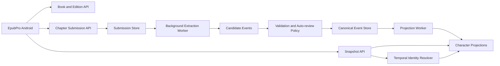

# Shared Character Profile Book Bible — Design

## Status

- Design status: approved
- Scope: backend architecture and API contract; no implementation in this document
- Target: MVP for a small audience, with a data model that can grow to a public deployment

## 1. Objective

Build a shared Book Bible managed by `EpubBackend` that can reconstruct each character's profile at a requested chapter without exposing information from later chapters.

The Android client owns the reading experience, local progress and offline cache. The backend owns book and edition matching, chapter mapping, AI extraction, canonical character events, automatic review, timeline resolution and snapshot generation.

## 2. Confirmed product rules

- Book Bible data is shared by book, not stored separately for each user.
- The backend does not store user accounts, personal overlays or user reading progress in this MVP.
- Android sends the edition and currently opened chapter with every snapshot request.
- A snapshot may only use information whose canonical chapter is less than or equal to the requested chapter.
- Character identity, aliases and character merges are themselves time-scoped facts.
- The MVP stores character-centric changes only, not a general plot summary.
- The backend accepts raw chapter text and structured event submissions from trusted clients.
- AI processing is asynchronous; snapshot reads never call AI.
- Raw chapter text is temporary and is removed after extraction or terminal failure.
- The canonical timeline is append-only. Corrections reject or supersede earlier events rather than deleting history.

## 3. Non-goals

- User authentication and server-side reading progress
- Per-user corrections or personal overlays
- Full-story or chapter-summary timelines unrelated to character state
- Local AI management on Android
- Storing complete EPUBs or chapter bodies permanently
- Allowing Android to select the AI provider, model or prompt
- Pre-analyzing an entire book by default

## 4. Assumptions

- Firestore remains the primary persistent store for the first implementation.
- Write endpoints are restricted by trusted-client attestation or an equivalent credential mechanism.
- A static API key embedded in the APK is not treated as the only security boundary.
- Canonical chapter ordering and edition-to-canonical chapter mapping can be resolved or explicitly confirmed.
- The initial deployment is small, but unbounded event arrays will not be stored in a single Firestore document.
- Automatic review uses independent source/fingerprint groups because end-user identity is not available.

## 5. Architecture



### Write path

1. Resolve or register the book and edition.
2. Accept raw chapter text or structured events with an idempotency key.
3. Persist the submission and return `202 Accepted`.
4. Map the local chapter to its canonical chapter.
5. Extract and normalize candidate events.
6. Resolve character identity using only knowledge valid at that chapter.
7. Aggregate evidence and apply automatic review policy.
8. Append approved canonical events and increment `book_revision`.
9. Rebuild affected projections and atomically publish the new projection revision.

### Read path

1. Receive `edition_id` and local chapter.
2. Map the local chapter to a canonical chapter.
3. Load the nearest complete projection checkpoint not after that chapter.
4. Replay the short event range between the checkpoint and requested chapter.
5. Resolve aliases, relationships and identity links at the requested time.
6. Return only characters and facts visible at that chapter.

## 6. Book and edition identity

### Book

`book_id` represents the canonical work and owns the shared Book Bible.

Suggested fields:

- `book_id`
- canonical title and normalized title
- author and normalized author
- original language
- lifecycle status
- current `book_revision`

### Edition

`edition_id` represents one EPUB, source, translation or chapter structure.

Suggested fields:

- `edition_id`
- `book_id`
- source metadata
- title, author, language and publisher metadata
- file/structure/content-sample fingerprints
- matching confidence and confirmation status
- chapter count and mapping revision

Metadata narrows matching candidates. Content and structure fingerprints provide stronger confirmation. Hashing the complete EPUB alone is insufficient because cover, packaging and metadata changes would produce a different hash for the same content.

### Chapter mapping

Each local chapter maps to a canonical chapter or canonical chapter range. A range is required when an edition combines or splits chapters differently.

If mapping confidence is insufficient, the backend returns `chapter_mapping_required`; it must not guess a chapter boundary that could cause spoilers.

## 7. Canonical event model

Characters have stable technical identities. Mutable profile state is represented by events rather than fields on the character document.

Example:

```json
{
  "event_id": "event-1",
  "book_id": "book-1",
  "character_id": "char-1",
  "canonical_chapter": 120,
  "category": "realm",
  "attribute_key": "cultivation_realm",
  "operation": "set",
  "value": {"name": "Kim Dan"},
  "certainty": "observed",
  "status": "approved",
  "supersedes_event_id": null,
  "schema_version": 1
}
```

### Categories

- `realm`
- `skill`
- `power`
- `item`
- `pet`
- `identity`
- `faction`
- `relationship`
- `status`
- `location`
- `custom`

### Operations

- `set`
- `add`
- `remove`
- `increase`
- `decrease`
- `link`
- `unlink`
- `correct`

### Certainty

- `observed`
- `stated`
- `rumor`
- `inferred`
- `contradicted`

### Temporal identity

Identity discoveries, alias additions and character links are stored as chapter-scoped events. If chapter 300 reveals that a masked person is an existing character, snapshots before chapter 300 retain the unknown identity and do not expose the later merge.

## 8. Storage layout

Logical collections:

- `books`
- `editions`
- edition chapter mappings
- `characters`
- `character_events`
- `submissions`
- candidate events
- `event_evidence`
- projection checkpoints and shards

Large timelines and projections must use subcollections or shards. They must not be embedded as ever-growing arrays inside one `book_bibles/{book_id}` document.

Projection checkpoints are created periodically, initially around every 25–50 canonical chapters. Large checkpoints are sharded. The interval remains an implementation configuration, not an API contract.

## 9. API contract

```text
POST /api/v1/books/resolve
POST /api/v1/books/{book_id}/editions
POST /api/v1/editions/{edition_id}/chapters/{local_chapter}/submissions
GET  /api/v1/submissions/{submission_id}
GET  /api/v1/editions/{edition_id}/chapters/{local_chapter}/snapshot
GET  /api/v1/editions/{edition_id}/chapters/{local_chapter}/characters/{character_id}/timeline
```

### Book resolution

`POST /books/resolve` receives metadata and sample fingerprints and returns one of:

- `matched`
- `confirmation_required`
- `new_book`

### Submission

The submission endpoint accepts either:

```json
{
  "input_type": "chapter_text",
  "content": "...",
  "content_fingerprint": "..."
}
```

or:

```json
{
  "input_type": "structured_events",
  "events": []
}
```

The client supplies `Idempotency-Key`. The endpoint returns `202 Accepted` with a `submission_id` and one of these states:

- `queued`
- `processing`
- `reviewing`
- `completed`
- `failed`

### Snapshot

Example response envelope:

```json
{
  "book_id": "book-1",
  "edition_id": "edition-a",
  "requested_chapter": 137,
  "canonical_chapter": 135,
  "book_revision": 42,
  "projection_revision": 42,
  "projection_status": "ready",
  "snapshot_status": "complete",
  "complete_through_chapter": 135,
  "characters": []
}
```

Timeline endpoints also require a chapter boundary. The Android-facing API does not return an unbounded full timeline containing future events.

## 10. Automatic review policy

The initial policy is conservative:

- Repeated submissions with the same content fingerprint do not count as independent evidence.
- An evidence group is derived from edition lineage and chapter fingerprint.
- Two model calls over the same content are not independent evidence.
- A candidate is approved only when at least two independent evidence groups agree, evidence is clear and the canonical timeline has no unresolved conflict.
- One-source candidates remain pending and are absent from the shared snapshot.
- Rumor and inference certainty cannot be silently promoted to observed.
- Corrections require stronger evidence than the event they supersede.
- Identity links and reveal events use stricter thresholds because an incorrect link can create spoilers across many facts.

The exact confidence thresholds and evidence weights are configuration and must be covered by policy tests.

## 11. Snapshot semantics

- Snapshot state is calculated at the chapter currently requested, not the furthest chapter ever read.
- A character first appearing after the requested chapter is absent.
- Future aliases, identity links, relationships and metadata are absent.
- In a gap such as analyzed chapters 50 and 200, a chapter-100 snapshot may use only state at or before chapter 100.
- If analysis is incomplete, the backend returns the latest confirmed state with `snapshot_status: partial` and `complete_through_chapter`.
- While projection rebuild is in progress, the last complete revision remains available with `projection_status: stale`.
- A new projection revision is published atomically after all required shards are complete.
- Responses support `ETag` based on book revision, canonical chapter and schema version.

## 12. Idempotency and consistency

The system is eventually consistent and retry-safe.

The submission identity includes the edition, canonical mapping, content fingerprint and client idempotency key. Repeating a request after timeout or offline replay must return the same logical submission and must not create duplicate canonical events.

Canonical event append and revision advancement use a transaction. Projection generation is separate; failure does not corrupt the event log or make a partial projection visible.

## 13. Raw content retention

- Raw chapter content is encrypted while temporarily queued.
- It is deleted immediately after successful extraction.
- Terminal failures are cleaned up by a bounded TTL.
- Logs never include full chapter content.
- Persistent evidence is short and length-limited.
- Reprocessing after a schema or model upgrade requires an authorized source to submit content again.

## 14. Error handling

- `validation_failed`: terminal; do not retry.
- `mapping_required`: wait for a valid chapter mapping.
- `provider_unavailable`: retry with exponential backoff and jitter.
- `extraction_invalid`: retry a bounded number of times with schema validation.
- `policy_pending`: valid non-terminal review state awaiting evidence.
- `projection_failed`: retain and serve the previous complete projection.
- Exhausted retries: mark the submission failed, send it to a dead-letter workflow and clean up raw content by TTL.

## 15. Security

- All write endpoints require trusted-client attestation or equivalent credentials.
- Read and write endpoints have rate limits appropriate to their cost.
- Limits apply to content size, evidence length, event count and submission frequency.
- Chapter content and structured events are untrusted inputs.
- Prompt content is isolated from system instructions and extraction uses validated structured output.
- Client-submitted events never bypass canonical validation and auto-review.
- Logs exclude secrets, raw chapters and full prompt bodies.

## 16. Observability

Track at minimum:

- queue and end-to-end processing latency
- extraction and schema-validation failure rate
- deduplication rate
- pending, approval and conflict rates
- projection lag and rebuild failures
- snapshot p50, p95 and p99 latency
- raw-content cleanup failures

Logs use opaque IDs and shortened fingerprints for correlation.

## 17. Testing strategy

### Unit and property tests

- Event schema, operations, certainty and version validation
- Temporal resolver never reading a future event
- Evidence deduplication and conservative review policy
- Identity reveal boundaries
- Checkpoint plus incremental replay matching full event replay

### Integration tests

- Submission through extraction, review, event append, projection and snapshot
- Worker retry and crash safety
- Firestore transaction and atomic projection publication
- Android API contract compatibility by schema version

### Required regression scenarios

- Read chapter 50, then 200, then return to 100
- Identity revealed only at chapter 300
- Acquire, lose and reacquire an item
- Rumored death later contradicted
- Editions that split or combine chapters differently
- Retry the same submission ten times
- Correct an old event and rebuild affected projections
- Projection failure while the previous snapshot remains readable

### Performance and security tests

- Simulate thousands of chapters, hundreds of characters and tens of thousands of events.
- Target snapshot p95 below approximately 500 ms when a projection is available.
- Exercise oversized payloads, forged structured events, prompt injection, rate-limit bypass and raw-content log leakage.

## 18. Principal risks

- Conservative review may leave a new edition pending for a long time when no independent source exists.
- Incorrect edition or chapter mapping can create spoilers across all downstream snapshots.
- Temporal identity resolution is more complex than globally merging aliases.
- Corrections to old chapters may cause expensive projection rebuilds.
- Without user identity, source independence is weaker and must be estimated from edition lineage and fingerprints.
- Firestore read and write costs can grow if projection sharding and checkpoint intervals are poorly tuned.

## 19. Decision log

| Decision | Alternatives considered | Reason |
|---|---|---|
| Shared Book Bible per canonical book | Per-user Bible; shared core plus personal overlay | Reuse analysis and centralize backend ownership; personal data is deferred |
| Snapshot at currently opened chapter | Furthest-read chapter; toggle between both | Provides historically correct profiles and avoids future-state leakage |
| Canonical `book_id` plus `edition_id` | Whole-file hash only; manual book selection only | Supports multiple sources and differing EPUB packaging |
| Metadata plus fingerprints | Metadata only; raw EPUB hash | Improves matching confidence while remaining resilient to packaging changes |
| Event source plus materialized projections | Replay all events on read; snapshot per chapter | Preserves audit history and keeps reads fast without duplicating every chapter |
| Append-only corrections | In-place update or deletion | Enables audit, deterministic replay and safe projection rebuild |
| Temporal identity events | Global character merge; never merge | Prevents future identity reveals from leaking into earlier snapshots |
| Conservative automatic review | Balanced or aggressive approval | Protects the shared canonical Bible from weak or conflicting evidence |
| Accept raw text and structured events | Raw text only; structured events only | Supports backend extraction and trusted external extractors through one policy path |
| Backend-owned AI configuration | Client-selected provider/model | Keeps Android contracts stable and centralizes quality/version control |
| Asynchronous idempotent processing | Synchronous AI calls; best-effort writes | Supports offline replay, retries and responsive clients |
| No persistent raw chapters | Encrypted permanent storage; licensed-source storage | Reduces privacy, copyright and storage risk |
| Character-centric MVP | Full plot timeline | Delivers the requested profile feature without expanding scope prematurely |
| No user identity in MVP | Firebase Auth; backend-managed JWT | Personal overlays and server progress are explicitly deferred |

## 20. Relationship to the current implementation

The existing Book Bible schema stores canonical character snapshots and an append-only timeline specifically for address observations. The new design generalizes that concept to all character profile changes.

Migration planning must preserve existing `CharacterEntry`, `AddressObservation`, pending changes and current API behavior until a versioned replacement is available. This document does not authorize or define the implementation migration sequence.

